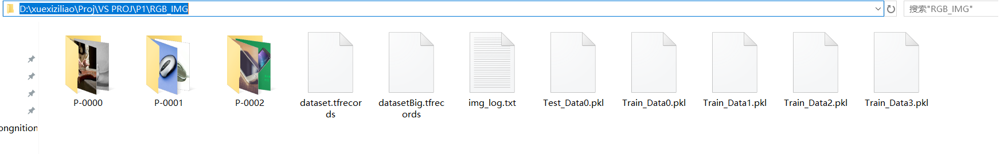

# <font color=#00ffa0 face=""><center>ImgLibMaker Manual</center></font>


## 1. Introduction

This is a simple program to zip image file(.jpg) to .plk file with Python pickle library. The python version is 3.6.4.

If you are working on Image classify/object detection area and you do not want to use those standard image library(mnist/cifar .etc), this program is suitable for you.

## 2. How to use

The main program is **ImageHandle.py** and there are four input arguments for the program:
* --Path_Dir
* --reshape
* --img_num_each_file
* --test_num_each_class

--Path_Dir is the direction of your images stored, your image recommanded to store in one folder like this:

<ul class='background-message'>
  <li></li>
</ul>


### aa
#### aa
##### aa

```python
import numpy as np

```
1.  <p> This is code </p>
<pre><code>
  write_log(Path_Dir)
  &amp;copy; asarray
</code><pre>
* c
***
---

I got a web [__baidu__] [id]

  [id]: www.baidu.com "aaa"


this is <code>printf()</code> func
